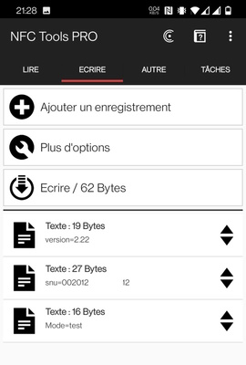
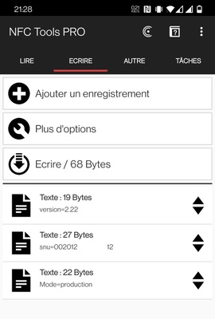
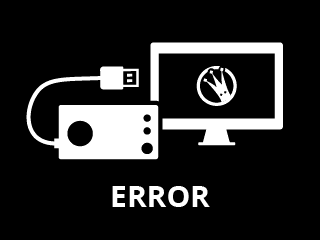

# Summary
- [Summary](#summary)
- [Memory layout](#memory-layout)
  - [Bootloader Firmware](#bootloader-firmware)
  - [Main Firmware](#main-firmware)
    - [Mapping](#mapping)
  - [Backup Firmware](#backup-firmware)
  - [SNU location](#snu-location)
- [Test Mode](#test-mode)
  - [How to enable ?](#how-to-enable-)
  - [Behavior](#behavior)
  - [Debug commands](#debug-commands)
    - [Handlers](#handlers)
    - [List](#list)
- [Security study](#security-study)
  - [Ghidra Project](#ghidra-project)
    - [How to import](#how-to-import)
  - [Thoughts](#thoughts)
    - [Firmware CRC](#firmware-crc)
    - [Custom firmware](#custom-firmware)
      - [Boot procedure](#boot-procedure)
    - [NFC chip](#nfc-chip)
    - [Finding SD Ciphering](#finding-sd-ciphering)
- [Crypt-Analysis](#crypt-analysis)
- [Symbols](#symbols)
- [Resources](#resources)
  - [Internal res](#internal-res)
    - [Bitmaps](#bitmaps)
    - [MP3](#mp3)
  - [SD structure \& Files](#sd-structure--files)
  - [Files Format](#files-format)
    - [.md](#md)
    - [.pi](#pi)
    - [.cfg](#cfg)
    - [.content/XXXXYYYY](#contentxxxxyyyy)
    - [.content/nm](#contentnm)
    - [.content/XXXXYYYY/ri](#contentxxxxyyyyri)
    - [.content/XXXXYYYY/si](#contentxxxxyyyysi)
- [Links](#links)


# Memory layout


Three of them are of interest:
1. QuadSPI external flash from `0x80000000_0x9FFFFFFF`   
   512KB are split in two 256KB parts. One for current firmware, and another for backup.
    * 1st 256K pane : Firmware A in `0x90000000_0x9003FFFF`   
    * 2nd 256K pane : Firmware B in `0x9003FFFF_0x9007FFFF`   
2. Internal flash from `0x08000000_0x0800FFFF`
3. Internal RAM from `0x20000000_0x2003FFFF`

## Bootloader Firmware

1. Initialize many peripheral (FPU, RCC, GPIOF/C/A/D, ADC3, UART4, CRC, QSPI)
2. Check that batt level not critical (or abort)
3. Check for Firmware update
   1. only if USB is plugged
   2. preapre SDMMC2
   3. mount sdcard
   4. Try to open `fa.bin`
   5. if exists, read crc and check update crc
   6. if CRC ok : erase sectors and write main firmware
   7. Close, remove update file, umount SD
4. Read main FW CRC and check it
5. if failed, backup FW
   1. Read backup FW CRC and check it
   2. if CRC ok : erase sectors and write backup firmware to main 
   3. if any error, dead loop
7. Init QPSI (if not done yet)
8. Switch to main FW

This FW contains FatFs (different config) for SD access and performs read/write to QSPI flash though commands   
It also contains storyteller identification data :
* `0x0800C000_0x0800C007` - SNU  
* `0x0800C008_0x0800C088` - Extra data ciphered ? (including second Key)  

**TODO** : 
- <s>review addresses for Backup & Main FW around checks and restore</s>

## Main Firmware
The full firmware ! might be located at `0x90000000`  
**Version =** 2.22

### Mapping

Few interesting offsets :
* `0x90000000` - 0x1E0 Bytes : VectorTable
* `0x90000400` - 4 Bytes : Firmware CRC offset

## Backup Firmware
A short mini firmware ! might be located at `0x90040000`   
**Version =** 2.16   
**Objective =** make sure that an USB mass storage is accessible for MainFW reload

## SNU location

8 bytes for SNU located at : `0x0800C000_0x0800C007` (internal flash)   
All around .md file that is recreated if not there.
How and when is it inserted into bootloader firmware ?   

# Test Mode

## How to enable ?
update of NFC chip
## Behavior

## Debug commands

Handled by a shell function here
```
lunii_shell	90013d50	Function	Global	User Defined	1	0
```

This function compares text read (from UART ? TBC), against a table of handlers.

### Handlers
The handlers are located at `90036854  CMD_LIST[0x18]`

Each CMD_LIST is made of :
* `char * COMMAND`
* `void (* fn)(void)`

9003684c
### List
- SOFTWARE_VERSION
- HARDWARE_VERSION
- VBAT?
- NFC_READ?
- NFC_WRITE
- NFC_UUID?
- MCU_UUID?
- BOUTONS_POUSSOIR
- BOUTON_SELECTION
- ECRAN_LOGO
- ECRAN_DAMIER
- ECRAN_DAMIER_IN
- ECRAN_OFF
- WHITE_SCREEN
- SDCARD_MOUNTED?
- WRITE_KEY_UUID
- REBOOT
- AUDIO_JACK
- AUDIO_SPEAKER
- AUDIO_OFF
- JACK_PRESENCE?
- AUTOTEST?
- SDCARD_CHECKSUM
- SDCARD_VERSION

# Security study

## Ghidra Project

You will find Ghidra archive in this repo. These archives contains all the work performed on understanding, renaming, decompiling the Lunii Firmware.

Thanks to the following tools:
* https://securelist.com/how-to-train-your-ghidra/108272/
* https://github.com/leveldown-security/SVD-Loader-Ghidra   
  https://raw.githubusercontent.com/posborne/cmsis-svd/master/data/STMicro/STM32F7x3.svd
* https://github.com/TorgoTorgo/ghidra-findcrypt
* ...
### How to import
1. Open Ghidra
2. Ensure that there is no active project
3. File / Restore Project
4. Pick `...something.../Lunii.RE/ghidra/Lunii_2023_MM_DD.gar` in Archive File
5. **Restore Directory** & **Project Name** must be filled automatically with
   * `...something.../Lunii.RE/ghidra`
   * `Lunii`


## Thoughts

### Firmware CRC
refer to [MainFW Mapping](#mapping)

### Custom firmware
* build the firmware archive
* to output internal values ?
* to decipher files on uart ?

Firmware archive seems to be named as :  
`boot.bin @08006294 : fa.bin`   
Firmware update seems to be a simple file starting from vectors, ending after expected CRC

#### Boot procedure
1. check for USB power source connected   
   Otherwise upgrade process is skipped
2. Looks for `fa.bin` file
3. Check internal CRC
4. Write to Main FW memory segment
5. jump to Main FW

You can retrieve this execution flow in ghidra here :   `boot.bin @08005f04`   


### NFC chip
* Match TBD dump against frame build in Main FW

NFC chip is a simple tag using NDEF standard. A basic 512 byte memory.   

Acces level are Read & Write. With a simple smartphone, you should be able to update contents, and eventually switch to test mode.   

SNU and Version are restored at each boot on Production mode.
Just writing `Mode=test` or `Mode=Production` should be enough.   

Using an android application like [NFC Tools](https://play.google.com/store/apps/details?id=com.wakdev.wdnfc), you can dump contents :
  


To reprogram it in test mode or production mode, just configure data like   




If `pi` tag is available, it is copied to SD to `.pi` file. File is overwritten.


### Finding SD Ciphering
There are two functions that performs the same action but from different source :
* `HAL_SCR_displayPicture_fromBuffer` (from a bitmap read in firmware, as identified in this section [Bitmaps](#bitmaps))
* `HAL_SCR_displayPicture_fromFile` (from a file in internal SD card, which are ciphered)

It means that the second handles deciphering, and next displays it (calling the first **HAL_SCR_displayPicture_fromBuffer** or calling same internal functions).

Analysis of `HAL_SCR_displayPicture_fromBuffer`
```
Outgoing References - HAL_SCR_displayPicture_fromBuffer
+- printf_level
+- FUN_9000e334
  +- FUN_9000ecec
  +- bmp_decoder_ReadDataBuff
  +- FUN_9000ed1c
  +- FUN_9000ed4c
+- FUN_900117d8
```

Analysis of `HAL_SCR_displayPicture_fromFile`
```
Outgoing References - HAL_SCR_displayPicture_fromFile
+- printf_level
+- FUN_9000e334
  +- FUN_9000ecec
  +- bmp_decoder_ReadDataBuff
  +- FUN_9000ed1c
  +- FUN_9000ed4c
+- HAL_FS_fileClose
+- sleep_ms
+- FUN_900117d8
```

Same stack.  `bmp_decoder_ReadDataBuff` might adapt based on global variables, and skip f_read part if using flash pointer.    

```
If ciphered, it has to be unciphered.
If written ciphered, it has to be 1. read, 2. unciphered
Checking all f_read() calls

HAL_FS_fileRead -> reads & decipher
HAL_FS_decipher

No opposite operation with write. Most of writtings might be performed by host computer, already ciphered. 
To check with root files, like .md
```

# Crypt-Analysis 
[Here](CIPHERING.md)

# Symbols
[Here](SYMBOLS.md.md)

# Resources

## Internal res

### Bitmaps

| Address | Label | Image |
|-|-|-|
| 0x9001C04E | BITMAP_WAKEUP |  |
| 0x9001D37E | BITMAP_LUNII_ERROR |  |
| 0x9001EB94 | BITMAP_LUNII |  |
| 0x9001FF32 | BITMAP_LOW_BATTERY |  |
| 0x900215F4 | BITMAP_MODE_TEST |  |
| 0x90023C3A | BITMAP_SLEEP |  |
| 0x90024C18 | BITMAP_NOSDCARD |  |
| 0x900262A4 | BITMAP_SDERROR |  |
| 0x90027B80 | BITMAP_LUNII_APP |  |
| 0x90028F12 | BITMAP_USB |  |

### MP3 
| Address | Size | Label | 
|-|-|-|
| 0x9002aba2 | 0x0C60 (3168) | [Howl](dump/mp3/howl.mp3) |
| 0x90029a76 | 0x1128 (4392) | [Birds](dump/mp3/birds.mp3) |
| 0x9002bdf8 | 0x5028 (20520) | [BEEP_1KHz](dump/mp3/beep_1khz.mp3) |
| 0x900313e4 | 0x55ec (21996) | [BEEP_10KHz](dump/mp3/beep_10khz.mp3) |

## SD structure & Files 
NOTE : **Ciphered files are only protected on first 0x200 block !**

Keys :
* <u>Generic</u> : stands for Generic Key (common to all sotrytellers)
* <u>Device</u> : stands for Device Key (specific to one specific device)

| File | Key | Contents|
|-|-|-|
|`sd:0:\.pi` | None | Pack Index<br>recreated by main FW |
|`sd:0:\.cfg` | None | Configuration file |
|`sd:0:\.md` | Generic | Metadata<br>(contents from internal flash, two block of 512B, 1st with SNU, 2nd with ciphered data and Key_B)
|`sd:0:\version` | None | contains a simple date      
|`sd:0:\.content\XXXXXXXX\bt` | Device ? | To validate that this device is authorized to play this story ??? |
|`sd:0:\.content\XXXXXXXX\li` | Generic ? | ??? |
|`sd:0:\.content\XXXXXXXX\ni` | None | metadata for story selection / navigation ? |
|`sd:0:\.content\XXXXXXXX\nm` | Generic | metadata to resume ? |
|`sd:0:\.content\XXXXXXXX\ri` | Generic | Resource Index : Ciphered text file that contains resource list   
|`sd:0:\.content\XXXXXXXX\si` | Generic | Song Index : Ciphered text file that contains song list   
|`sd:0:\.content\XXXXXXXX\rf\` | N/A | Resource Folder 
|`sd:0:\.content\XXXXXXXX\rf\000\YYYYYYYY` | Generic | Resources (BMP)  
|`sd:0:\.content\XXXXXXXX\sf\` | N/A | Song Folder
|`sd:0:\.content\XXXXXXXX\sf\000\YYYYYYYY` | Generic | Songs, story part and heros names (MP3)

## Files Format
### .md
``` 
--- First 256B Block --- PLAIN ---
0300 FFFFFFFF (Static)
0200 : Version Major (2)
1600 : Version Minor (22)
       > v2.22
0020121111223344 : SNU - Storyteller Unique ID       
830441A34E5350454349414C0000 (Static)
00...00 : 0xE0 Bytes of padding with 00 

--- Second 256B Block --- CIPHERED ---
31333934313151 0700 2600 3EF0112233 : 7Bytes of Unique Dev ID + 2 WORDS + 5 static Bytes
0000XXYY 60 times (0xF0) : TBD
```
### .pi
This file is the root files that stores all stories available in device. It contains a simple list of UUID (16 Bytes).
```
C4139D59-872A-4D15-8CF1-76D34CDF38C6
....
123e4567-e89b-12d3-a456-426652340000
```

End of UUIDs (last 8 Bytes) are used to sort stories in subdirectories.

Known UUID stories :
| UUID | Story name |
|-|-|
| C4139D59-872A-4D15-8CF1-76D34CDF38C6 | Suzanne et Gaston |
| 03933BA4-4FBF-475F-9ECC-35EFB4D11DC9 | TBD |
| 22137B29-8646-4335-8069-4A4C9A2D7E89 | TBD |
| 29264ADF-5A9F-451A-B1EC-2AE21BBA473C | TBD |
| 2F0F3109-BFAE-4E09-91D7-CA0C2643948D | TBD |
| 3712AF6D-CF9D-4154-8E98-56821362862A | TBD |
| 4C40E9EA-B116-4126-85B6-EFC28ECE8475 | TBD |
| 59A710E9-2F7A-4D0C-AB2D-47E8DD2E29B7 | TBD |
| 6795F69B-6B7C-4543-AED9-41C946DD33A2 | TBD |
| 9C836C24-34C4-4CC1-B9E6-D8646C8D9CF1 | TBD |
| 9D9521E5-84AC-4CC8-9B09-8D0AFFB5D68A | TBD |
| AA0BC5DD-16FA-4362-859C-0DB158139FE6 | TBD |
| BF573171-5E5D-4A50-BA89-403277175114 | TBD |
| C19C99FA-7069-44A1-8F3A-C299908EB595 | TBD |
| D56A4975-417E-4D04-AEB3-21254058B612 | TBD |
| FB2B7DF4-BE3F-4998-83F0-BFBBDA75B9D7 | TBD |
| ... | ... |


### .cfg
This is a config file. Fixed size of 38 Bytes, no ciphering applied on it.   
File is made of 8 tags :   
```
0100
  XXXX YYYY (TAG_00 VALUE_00)
  XXXX YYYY (TAG_01 VALUE_01)
  ...
  XXXX YYYY (TAG_08 VALUE_08)
```
| ID | Tag Len | Value Len | Role |
|-|-|-|-|
| 0 | WORD | WORD | idle time before sleep mode |
| 1 | WORD | WORD | Current story time position ? |
| 2 | WORD | WORD | Time to display Low battery message |
| 3 | WORD | WORD | TBD |
| 4 | WORD | WORD | TBD |
| 5 | WORD | WORD | TBD |
| 6 | WORD | WORD | Boolean related to 05<br>If True => (uint)CFG_TAG_04) / (CFG_TAG_05 - 1) |
| 7 | WORD | WORD | TBD |
| 8 | WORD | WORD | Request to recreate `.nm` file |

### .content/XXXXYYYY
This is the root directory for a specific story. The name `XXXXYYYY` is based on the lower part of the UUID.

For example, the "Suzanne et Gaston" story :
* UUID : C4139D59-872A-4D15-8CF1-76D3`4CDF38C6`
* root diretory : `.content/4CDF38C6`
### .content/nm 
### .content/XXXXYYYY/ri
This file is the Resource Index that stores all resources available for the `XXXXYYYY` story. It is a text plain file (not ciphered).   
The file is organized as a list of 12 Bytes strings
```
000\AABBCCDD000\BBCCDDEE...000\CCDDEEFF 
```
### .content/XXXXYYYY/si
This file is the Song Index that stores all resources available for the `XXXXYYYY` story. It is a text plain file (not ciphered).   
The file is organized as a list of 12 Bytes strings
```
000\AABBCCDD000\BBCCDDEE...000\CCDDEEFF 
```

# Links

- https://www.youtube.com/watch?v=ZeYKieOIsC8
- https://fr.wikipedia.org/wiki/Tiny_Encryption_Algorithm
- https://github.com/coderarjob/tea-c
