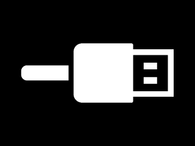

# Summary
- [Summary](#summary)
- [Memory layout](#memory-layout)
  - [Bootloader Firmware](#bootloader-firmware)
  - [Main Firmware](#main-firmware)
    - [Mapping](#mapping)
  - [Backup Firmware](#backup-firmware)
  - [SNU location](#snu-location)
- [Test Mode](#test-mode)
  - [How to enable ?](#how-to-enable-)
  - [Behavior](#behavior)
  - [Debug commands](#debug-commands)
    - [Handlers](#handlers)
    - [List](#list)
- [Security study](#security-study)
  - [Ghidra Project](#ghidra-project)
    - [How to import](#how-to-import)
  - [Thoughts](#thoughts)
    - [Firmware CRC](#firmware-crc)
    - [Custom firmware](#custom-firmware)
      - [Boot procedure](#boot-procedure)
    - [NFC chip](#nfc-chip)
    - [Finding SD Ciphering](#finding-sd-ciphering)
- [Crypt-Analysis](#crypt-analysis)
- [Symbols](#symbols)
- [Resources](#resources)
  - [Internal res](#internal-res)
    - [Bitmaps](#bitmaps)
    - [MP3](#mp3)
  - [SD structure \& Files](#sd-structure--files)
  - [Stories Format](#stories-format)
    - [Resources : BMP](#resources--bmp)
    - [Audio : MP3](#audio--mp3)
    - [Indexes](#indexes)
  - [Files Format](#files-format)
    - [.md](#md)
    - [.pi](#pi)
    - [.cfg](#cfg)
    - [.nm](#nm)
    - [.content/XXXXYYYY](#contentxxxxyyyy)
    - [.content/XXXXYYYY/bt](#contentxxxxyyyybt)
    - [.content/XXXXYYYY/ni](#contentxxxxyyyyni)
    - [.content/XXXXYYYY/li](#contentxxxxyyyyli)
    - [.content/XXXXYYYY/ri](#contentxxxxyyyyri)
    - [.content/XXXXYYYY/si](#contentxxxxyyyysi)
    - [.content/XXXXYYYY/rf/000/YYYYYYYY](#contentxxxxyyyyrf000yyyyyyyy)
    - [.content/XXXXYYYY/sf/000/YYYYYYYY](#contentxxxxyyyysf000yyyyyyyy)
  - [Story UUIDs](#story-uuids)
    - [Known stories](#known-stories)
    - [Full story database](#full-story-database)
- [Links](#links)


# Memory layout


Three of them are of interest:
1. QuadSPI external flash from `0x80000000_0x9FFFFFFF`   
   512KB are split in two 256KB parts. One for current firmware, and another for backup.
    * 1st 256K pane : Firmware A in `0x90000000_0x9003FFFF`   
    * 2nd 256K pane : Firmware B in `0x9003FFFF_0x9007FFFF`   
2. Internal flash from `0x08000000_0x0800FFFF`
3. Internal RAM from `0x20000000_0x2003FFFF`

## Bootloader Firmware

1. Initialize many peripheral (FPU, RCC, GPIOF/C/A/D, ADC3, UART4, CRC, QSPI)
2. Check that batt level not critical (or abort)
3. Check for Firmware update
   1. only if USB is plugged
   2. preapre SDMMC2
   3. mount sdcard
   4. Try to open `fa.bin`
   5. if exists, read crc and check update crc
   6. if CRC ok : erase sectors and write main firmware
   7. Close, remove update file, umount SD
4. Read main FW CRC and check it
5. if failed, backup FW
   1. Read backup FW CRC and check it
   2. if CRC ok : erase sectors and write backup firmware to main 
   3. if any error, dead loop
7. Init QPSI (if not done yet)
8. Switch to main FW

This FW contains FatFs (different config) for SD access and performs read/write to QSPI flash though commands   
It also contains storyteller identification data :
* `0x0800C000_0x0800C007` - SNU  
* `0x0800C008_0x0800C088` - Extra data ciphered ? (including second Key)  


## Main Firmware
The full firmware ! might be located at `0x90000000`  
**Version :** 2.22   
**Note :** This firmware can be updated

### Mapping

Few interesting offsets :
* `0x90000000` - 0x1E0 Bytes : VectorTable
* `0x90000400` - 4 Bytes : Firmware CRC offset

## Backup Firmware
A short mini firmware ! might be located at `0x90040000`   
**Version :** 2.16   
**Objective :** make sure that an USB mass storage is accessible for MainFW reload   
**Note :** This firmware in not expected to be updated, nor updatable
## SNU location

8 bytes for SNU located at : `0x0800C000_0x0800C007` (internal flash)   
All around .md file that is recreated if not there.
How and when is it inserted into bootloader firmware ?   

# Test Mode

## How to enable ?
update of NFC chip
## Behavior

## Debug commands

Handled by a shell function here
```
lunii_shell	90013d50	Function	Global	User Defined	1	0
```

This function compares text read (from UART ? TBC), against a table of handlers.

### Handlers
The handlers are located at `90036854  CMD_LIST[0x18]`

Each CMD_LIST is made of :
* `char * COMMAND`
* `void (* fn)(void)`

9003684c
### List
- SOFTWARE_VERSION
- HARDWARE_VERSION
- VBAT?
- NFC_READ?
- NFC_WRITE
- NFC_UUID?
- MCU_UUID?
- BOUTONS_POUSSOIR
- BOUTON_SELECTION
- ECRAN_LOGO
- ECRAN_DAMIER
- ECRAN_DAMIER_IN
- ECRAN_OFF
- WHITE_SCREEN
- SDCARD_MOUNTED?
- WRITE_KEY_UUID
- REBOOT
- AUDIO_JACK
- AUDIO_SPEAKER
- AUDIO_OFF
- JACK_PRESENCE?
- AUTOTEST?
- SDCARD_CHECKSUM
- SDCARD_VERSION

# Security study

## Ghidra Project

You will find Ghidra archive in this repo. These archives contains all the work performed on understanding, renaming, decompiling the Lunii Firmware.

Thanks to the following tools:
* https://securelist.com/how-to-train-your-ghidra/108272/
* https://github.com/leveldown-security/SVD-Loader-Ghidra   
  https://raw.githubusercontent.com/posborne/cmsis-svd/master/data/STMicro/STM32F7x3.svd
* https://github.com/TorgoTorgo/ghidra-findcrypt
* ...
### How to import
1. Open Ghidra
2. Ensure that there is no active project
3. File / Restore Project
4. Pick `...something.../Lunii.RE/ghidra/Lunii_2023_MM_DD.gar` in Archive File
5. **Restore Directory** & **Project Name** must be filled automatically with
   * `...something.../Lunii.RE/ghidra`
   * `Lunii`


## Thoughts

### Firmware CRC
refer to [MainFW Mapping](#mapping)

### Custom firmware
* build the firmware archive
* to output internal values ?
* to decipher files on uart ?

Firmware archive seems to be named as :  
`boot.bin @08006294 : fa.bin`   
Firmware update seems to be a simple file starting from vectors, ending after expected CRC

#### Boot procedure
1. check for USB power source connected   
   Otherwise upgrade process is skipped
2. Looks for `fa.bin` file
3. Check internal CRC
4. Write to Main FW memory segment
5. jump to Main FW

You can retrieve this execution flow in ghidra here :   `boot.bin @08005f04`   


### NFC chip
NFC chip is a simple tag using NDEF standard. A basic 512 byte memory.   

RF Acces level are Read Only. Writting require to present a password that can't be reset nor dumped. Changing values through RF is thus impossible.   

Based on FW analysis, SNU and Version are restored at each boot on Production mode. It means that memory contents a Read&Write allowed through I2C interface.

Using an android application like [NFC Tools](https://play.google.com/store/apps/details?id=com.wakdev.wdnfc), you can dump contents :
  


If `pi` tag is available, it is copied to SD to `.pi` file. File is overwritten.


### Finding SD Ciphering
There are two functions that performs the same action but from different source :
* `HAL_SCR_displayPicture_fromBuffer` (from a bitmap read in firmware, as identified in this section [Bitmaps](#bitmaps))
* `HAL_SCR_displayPicture_fromFile` (from a file in internal SD card, which are ciphered)

It means that the second handles deciphering, and next displays it (calling the first **HAL_SCR_displayPicture_fromBuffer** or calling same internal functions).

Analysis of `HAL_SCR_displayPicture_fromBuffer`
```
Outgoing References - HAL_SCR_displayPicture_fromBuffer
+- printf_level
+- FUN_9000e334
  +- FUN_9000ecec
  +- bmp_decoder_ReadDataBuff
  +- FUN_9000ed1c
  +- FUN_9000ed4c
+- FUN_900117d8
```

Analysis of `HAL_SCR_displayPicture_fromFile`
```
Outgoing References - HAL_SCR_displayPicture_fromFile
+- printf_level
+- FUN_9000e334
  +- FUN_9000ecec
  +- bmp_decoder_ReadDataBuff
  +- FUN_9000ed1c
  +- FUN_9000ed4c
+- HAL_FS_fileClose
+- sleep_ms
+- FUN_900117d8
```

Same stack.  `bmp_decoder_ReadDataBuff` might adapt based on global variables, and skip f_read part if using flash pointer.    

```
If ciphered, it has to be unciphered.
If written ciphered, it has to be 1. read, 2. unciphered
Checking all f_read() calls

HAL_FS_fileRead -> reads & decipher
HAL_FS_decipher

No opposite operation with write. Most of writtings might be performed by host computer, already ciphered. 
```

# Crypt-Analysis 
[Here](CIPHERING.md)

# Symbols
TODO
<!-- [Here](SYMBOLS.md.md) -->

# Resources

## Internal res

### Bitmaps

| Address | Label | Image |
|-|-|-|
| 0x9001C04E | BITMAP_DAY_MODE |  |
| 0x9001D37E | BITMAP_LUNII_ERROR |  |
| 0x9001EB94 | BITMAP_LUNII |  |
| 0x9001FF32 | BITMAP_LOW_BATTERY |  |
| 0x900215F4 | BITMAP_MODE_TEST |  |
| 0x90023C3A | BITMAP_NIGHT_MODE |  |
| 0x90024C18 | BITMAP_NOSDCARD |  |
| 0x900262A4 | BITMAP_SDERROR |  |
| 0x90027B80 | BITMAP_LUNII_APP |  |
| 0x90028F12 | BITMAP_USB |  |

### MP3 
| Address | Size | Label | 
|-|-|-|
| 0x9002aba2 | 0x0C60 (3168) | [Howl](dump/mp3/howl.mp3) |
| 0x90029a76 | 0x1128 (4392) | [Birds](dump/mp3/birds.mp3) |
| 0x9002bdf8 | 0x5028 (20520) | [BEEP_1KHz](dump/mp3/beep_1khz.mp3) |
| 0x900313e4 | 0x55ec (21996) | [BEEP_10KHz](dump/mp3/beep_10khz.mp3) |

## SD structure & Files 
NOTE : **Ciphered files are only protected on first 0x200 block !**

Keys :
* <u>Generic</u> : stands for Generic Key (common to all sotrytellers)
* <u>Device</u> : stands for Device Key (specific to one specific device)

| File | Key | Contents|
|-|-|-|
|[`sd:0:\.pi`](#pi) | None | Pack Index<br>recreated by main FW |
|[`sd:0:\.md`](#md) | Generic | Metadata<br>(contents from internal flash, two block of 512B, 1st with SNU, 2nd with ciphered data and Key_B)
|[`sd:0:\.cfg`](#cfg) | None | Configuration file |
|[`sd:0:\.nm`](#nm) | None | Night mode enabled if file exists (paramters are loaded from [config file](#cfg))
|`sd:0:\version` | None | contains a simple date      
|[`sd:0:\.content\XXXXXXXX\bt`](#contentxxxxyyyybt) | Device | Authoriaztion file. To validate that this device is authorized to play this story  |
|`sd:0:\.content\XXXXXXXX\li` | Generic | Action Nodes index |
|[`sd:0:\.content\XXXXXXXX\ni`](#contentxxxxyyyyni) | None | Stage Nodes index |
|`sd:0:\.content\XXXXXXXX\nm` | None | Night Mode related |
|[`sd:0:\.content\XXXXXXXX\ri`](#contentxxxxyyyyri) | Generic | Resource Index : Ciphered text file that contains resource list   
|[`sd:0:\.content\XXXXXXXX\si`](#contentxxxxyyyysi) | Generic | Story Index : Ciphered text file that contains story list   
|`sd:0:\.content\XXXXXXXX\rf\` | N/A | Resource Folder 
|[`sd:0:\.content\XXXXXXXX\rf\000\YYYYYYYY`](#contentxxxxyyyyrf000yyyyyyyy) | Generic | Resources (BMP)  
|`sd:0:\.content\XXXXXXXX\sf\` | N/A | Story Folder
|[`sd:0:\.content\XXXXXXXX\sf\000\YYYYYYYY`](#contentxxxxyyyysf000yyyyyyyy) | Generic | Story, audio part and heros names (MP3)

## Stories Format
### Resources : BMP
```
> mediainfo 2C3123BB.bmp
General
Complete name                            : 2C3123BB.bmp
Format                                   : Bitmap
File size                                : 6.52 KiB

Image
Format                                   : RLE4
Width                                    : 320 pixels
Height                                   : 240 pixels
Color space                              : RGB
Bit depth                                : 4 bits
```
### Audio : MP3
```
> mediainfo 0835BAD5.mp3
General
Complete name                            : 0835BAD5.mp3
Format                                   : MPEG Audio
File size                                : 14.6 KiB
Duration                                 : 1 s 880 ms
Overall bit rate mode                    : Variable
Overall bit rate                         : 61.8 kb/s
Writing library                          : LAME3.100

Audio
Format                                   : MPEG Audio
Format version                           : Version 1
Format profile                           : Layer 3
Duration                                 : 1 s 881 ms
Bit rate mode                            : Variable
Bit rate                                 : 61.8 kb/s
Minimum bit rate                         : 32.0 kb/s
Channel(s)                               : 1 channel
Sampling rate                            : 44.1 kHz
Frame rate                               : 38.281 FPS (1152 SPF)
Compression mode                         : Lossy
Stream size                              : 14.2 KiB (97%)
Writing library                          : LAME3.100
Encoding settings                        : -m m -V 4 -q 0 -lowpass 17.5 --vbr-new -b 32
```

### Indexes
Stories are built against index files that allow to create a navigation path through choices, building a custom story.

Indexes can be seen as a table of content.

Indexes files :
1) **ni** : [Node index](#contentxxxxyyyyni)   
   This one is the main story file that list all nodes for the story.   
   Each choice is named a node and is defined by a bitmap, an audio, and a next node.
   A story starts at the first node.
2) **li** : [Jump index](#contentxxxxyyyyli)
3) **ri** : [Resource index](#contentxxxxyyyyri)
4) **si** : [Story index](#contentxxxxyyyysi)

## Files Format
### .md
* **Length** : 0x200
* **Key** : plain / generic

Structure:

  `--- First 256B Block --- PLAIN ---`
``` 
0300 FFFFFFFF (Static)
0200 : Version Major (2)
1600 : Version Minor (22)
       > v2.22
0020121111223344 : SNU - Storyteller Unique ID       
830441A34E5350454349414C0000 (Static)
00...00 : 0xE0 Bytes of padding with 00 
``` 

  `--- Second 256B Block --- CIPHERED ---`

``` 
31333934XXYYZZ 0700 2600 3EF0112233 : 7Bytes of Unique Dev ID + 2 WORDS + 5 static Bytes
0000XXYY 60 times (0xF0) : TBD
```
### .pi
* **Length** : variable
* **Key** : None

This file is the root files that stores all stories available in device. It contains a simple list of UUID (16 Bytes).
```
C4139D59-872A-4D15-8CF1-76D34CDF38C6
....
123e4567-e89b-12d3-a456-426652340000
```

End of UUIDs (last 8 Bytes) are used to sort stories in subdirectories.

You can retreive more details on existing UUIDs on the dedicated section : [Story UUIDs](#story-uuids)


### .cfg
* **Length** : 0x26
* **Key** : None


This is a config file. Fixed size of 38 Bytes, no ciphering applied on it.   
File is made of 8 tags :   
```
0100
  XXXX YYYY (TAG_00 VALUE_00)
  XXXX YYYY (TAG_01 VALUE_01)
  ...
  XXXX YYYY (TAG_08 VALUE_08)
```
| ID | Tag Len | Value Len | Default Value | Max Value | Role |
|-|-|-|-:|-:|-|
| 0 | WORD | WORD | 300s | 3600s | idle time before sleep mode |
| 1 | WORD | WORD | 60s | 600s | TBD |
| 2 | WORD | WORD | 5s | 10s | Time to display Low battery message |
| 3 | WORD | WORD | 0 | | Night mode - Enable |
| 4 | WORD | WORD | 0 | | Night mode - Volume level |
| 5 | WORD | WORD | 3 | | Night mode - Stories to play before auto sleep mode |
| 6 | WORD | WORD | ? | | Boolean related to 05<br>If True => (uint)CFG_TAG_04) / (CFG_TAG_05 - 1) |
| 7 | WORD | WORD | 1 | | TBD |
| 8 | WORD | WORD | 1 | | Request to recreate `.nm` file |

Constraints can be retreived in the function `LUNII_load_config()`

### .nm
* **Length** : 0
* **Key** : None
This file acts as a boolean to enable or disable Night Mode (more details [here](https://support.lunii.com/hc/fr/articles/4404835664145-Quelles-sont-les-fonctionnalit%C3%A9s-du-Mode-Nuit-))

This mode helps your children to fall asleep by playing automatically many stories, with a decreasing volume, and a limited screen backlight. Three paramaters that might be retrieved in [configuration file](#cfg)

### .content/XXXXYYYY
This is the root directory for a specific story. The name `XXXXYYYY` is based on the lower part of the UUID.

For example, the "Suzanne et Gaston" story :
* UUID : C4139D59-872A-4D15-8CF1-76D3`4CDF38C6`

### .content/XXXXYYYY/bt
* **Length** : 0x40
* **Key** : device specific

This file seems to be the authorization file that is checked to avoid illegal stories copy.

It is made by ciphering the 0x40 first bytes for .ri file with device specific key.

### .content/XXXXYYYY/ni
* **Length** : 0x200 + N*0x2C
* **Key** : None
* **Purpose** : Nodes to navigate in story choices. 
 
This file has the following structure:

``` C
typedef enum <int> { 
    NODE_CHOICE    = 0x10001,
    NODE_INTER     = 0x10000,
} NODETYPE;

// Header is 0x200 long (512 Bytes)
typedef struct {
    int tbd_a[3];
    int index_count;
    int tbd_b[124];
} ni_header;

// Node list is 0x2C * index_count long
typedef struct {
    int image_ri_idx;         // index in ri file
    int audio_si_idx;         // index in si file
    int next_node;            // index loaded from li for next in ni
    int next_node_cnt;        // how many choices for next_node
                              // choices indexes are in range (li(next_node), li(next_node)+next_cnt )
    int tbd_a[4];             //
    NODETYPE type;            // type of node
    NODETYPE tbd;             //
    int tbd_b[1];
} node;

// Node Index file parsing
ni_header header;
node nodes[header.index_count];
```

Story starts at ``nodes[0]``   
You can retreive this management in Ghidra archive
* `story_selection()` @90010004
* `story_node_selection` @9000fda8

### .content/XXXXYYYY/li
* **Length** : N*4
* **Key** : generic
* **Purpose** : Looks to be an indirection table to jump to next node
 
This file is a simple ``int`` table has the following structure:

``` C
// L Index file parsing
int indexes[FileSize()/4];
```


### .content/XXXXYYYY/ri
* **Length** : variable
* **Key** : generic

This file is the Resource Index that stores all resources available for the `XXXXYYYY` story. It is a text plain file (not ciphered).   
The file is organized as a list of ``12 char strings``
```
000\AABBCCDD000\BBCCDDEE...000\CCDDEEFF 
```
### .content/XXXXYYYY/si
* **Length** : variable
* **Key** : generic
 
This file is the Story Index that stores all resources available for the `XXXXYYYY` story. It is a text plain file (not ciphered).   
The file is organized as a list of ``12 char strings``
```
000\AABBCCDD000\BBCCDDEE...000\CCDDEEFF 
```
### .content/XXXXYYYY/rf/000/YYYYYYYY
* **Length** : variable
* **Key** : generic

These files store Resources, meaning images in a Bitmap format   

**FORMAT DETAILS** : [here](#resources--bmp)

### .content/XXXXYYYY/sf/000/YYYYYYYY
* **Length** : variable
* **Key** : generic

These files store Stories, meaning audio in a MP3 format   

**FORMAT DETAILS** : [here](#audio--mp3)

## Story UUIDs
### Known stories
| UUID | Story name | Picture |
|-|-|-|
| C4139D59-872A-4D15-8CF1-76D34CDF38C6 | Suzanne et Gaston | 
| 03933BA4-4FBF-475F-9ECC-35EFB4D11DC9 | Panique aux 6 Royaumes | 
| 22137B29-8646-4335-8069-4A4C9A2D7E89 | Au Pays des Loups | 
| 29264ADF-5A9F-451A-B1EC-2AE21BBA473C | Sur les bancs de l'école | 
| 2F0F3109-BFAE-4E09-91D7-CA0C2643948D | Le loup dans tous ses états | 
| 3712AF6D-CF9D-4154-8E98-56821362862A | Pandaroux et les Turbo-Héros | 
| 59A710E9-2F7A-4D0C-AB2D-47E8DD2E29B7 | Pandaroux | 
| 9C836C24-34C4-4CC1-B9E6-D8646C8D9CF1 | Les Aventures de Zoé -<br> Les 6 Royaumes | 
| 9D9521E5-84AC-4CC8-9B09-8D0AFFB5D68A | Suzanne et Gaston fêtent Pâques | 
| AA0BC5DD-16FA-4362-859C-0DB158139FE6 | Les bandes a écouter de Yakari | 
| BF573171-5E5D-4A50-BA89-403277175114 | En attendant Noël | 
| D56A4975-417E-4D04-AEB3-21254058B612 | Oh les pirates ! | 
| FB2B7DF4-BE3F-4998-83F0-BFBBDA75B9D7 | A la poursuite des 12 joyaux | 
| ... | ... |

### Full story database
The full list of all existing packs can be extracted from this file [packs.json](resources/packs.json)
# Links

- https://www.youtube.com/watch?v=ZeYKieOIsC8
- https://fr.wikipedia.org/wiki/Tiny_Encryption_Algorithm
- https://github.com/coderarjob/tea-c
