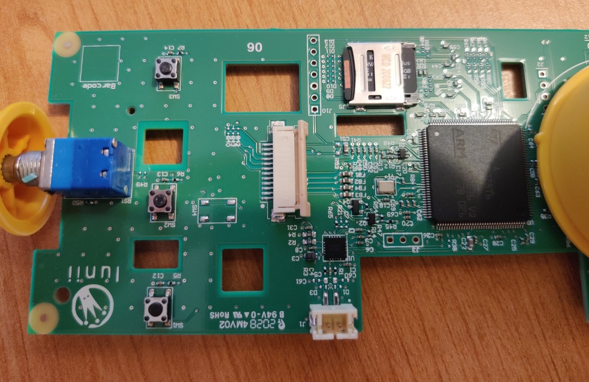
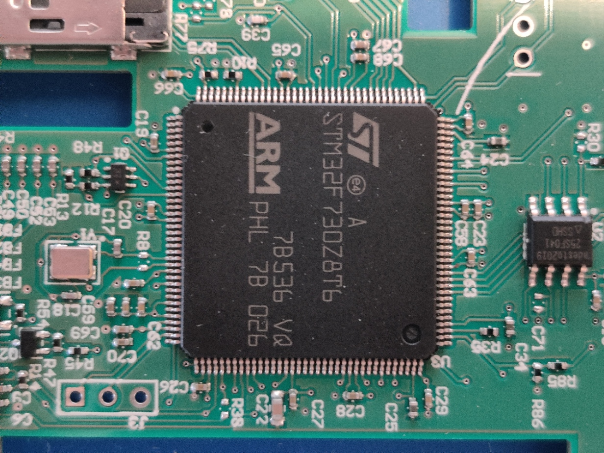
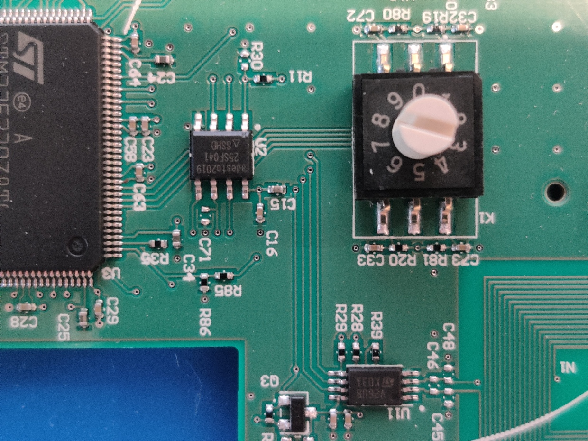
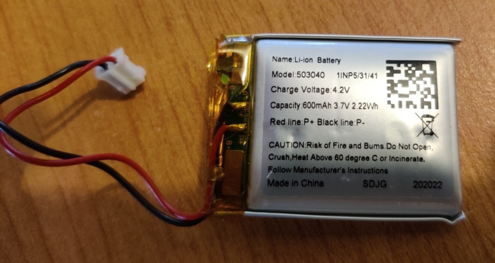

# Hardware

* Battery : Li-ion 4.2v 600mAh   
  Model 503040 - 1INP5/31/41
* Voltage Regulator : AP7362 (DIODES) 4.2v -> 3.3v
* Battery Management System (BMS) : MCP73833
* Main CPU : [STM32F730Z8T6](docs/stm32f730z8.pdf) - Cortex M7   
  RAM : 256KB / Flash : 64KB
    - [RM0431 - Reference manual](docs/rm0431-stm32f72xxx-and-stm32f73xxx-advanced-armbased-32bit-mcus-stmicroelectronics.pdf)
    -   [PM0253 - Programming manual](docs/pm0253-stm32f7-series-and-stm32h7-series-cortexm7-processor-programming-manual-stmicroelectronics.pdf)
* External Flash : adesto AT25SF041 - 512MB
  QSPI interface
* SD 16GB (SDIO interface)
* ST25DV04K (I2C interface)
  * [Datasheet](docs/st25dv04k.pdf)
  * [AN5439 - Application note](docs/an5439-augmented-ndef-with-st25dvi2c-series-dynamic-nfc-tags-stmicroelectronics.pdf)
* Audio ampli : PAM8019

# Pictures

## Main Board

## STM32F730Z8T6

## External Flash & NFC Frontend

## Battery

